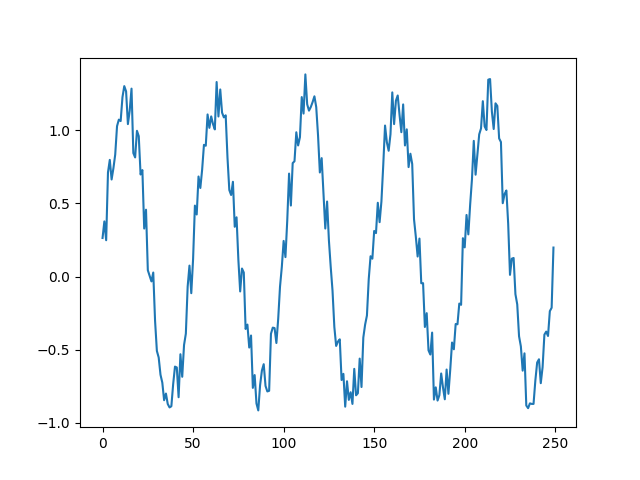

# LSTM

<pre>
void createSinData(float data[], int steps_per_cycle, int number_of_cycles){
    for (int j=0; j<number_of_cycles; j++){
        for (int i=0; i<steps_per_cycle; i++){
            float v = std::sin(i * 2 * std::atan(1) * 4 /  steps_per_cycle);

	    std::random_device rnd;     
	    std::mt19937 mt(rnd());     
	    std::uniform_int_distribution<> rand100(0, 99);        

	    cout << "test:" << (float)((float)rand100(mt)/(float)250) << endl;
	    v = v  + float((float)rand100(mt) / (float)250);
	    
            data[steps_per_cycle * j + i] = v;
        }
    }
}
</pre>
